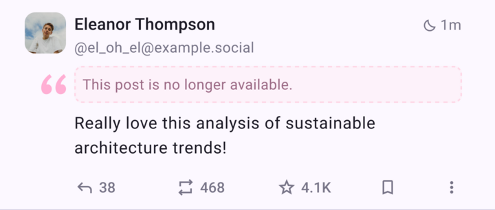

work by https://github.com/ClearlyClaire

> [!NOTE]
> The images in this document serve as references and early guidance for design exploration purposes only. They should not be considered as definitive or production-ready designs.

## High-level view of Quote Posts

At their core, quote posts are posts that directly reference another post, which is embedded or inlined in part or in full.

There are multiple variations of quote posts, the most commonly-known likely being Quote Tweet, Tumblr Reblogs, and forum quotes.

Forum quotes serve a slightly different purpose. Indeed, unlike Quote Tweets and Tumblr Reblogs, they are most commonly used to reference a post that appeared earlier in the same conversation, without changing the context nor the audience.

Another way they are different is that they are frequently used to quote only part of a post, or even alter it for conciseness or emphasis, which is not expected of Quote Tweets and similar.

Therefore, we will mostly focus on Quote Tweets, Tumblr Reblogs and Cohost Reblogs rather than forum quotes.

Quote Posts are commonly used to:

- recontextualize another post
- expose the user (with an introduction) to the booster's followers, in order to build community
- add a personal comment or anecdote to someone else's post
- debunk or clarify some piece of information
- provide a citation or reference when replying to a post asking for information
- make fun of, harass and “dunk” on other people

Common technical characteristics of quote posts include:

- one-click access to the quoted post
- the quoted person getting a notification about it
- from a quoted post, access to a list of posts quoting it
- sometimes, some level of control on who can quote you, and the ability to remove quotes

## Exploration of particular non-ActivityPub implementations

### Twitter

#### Functionality and presentation

On Twitter, Quote Tweets, also called “Retweet with Comment”, are primarily presented as a variant of Reposts, but replies can also be Quote Tweets.

In Quote Tweets, the quoted content appears below the comment being made, putting the emphasis on the comment.

Anyone can access a list of Quote Tweets quoting a Tweet they have access to, although this was recently de-emphasized.

Quote Tweets are known for being an integral part of a culture of dunking, which both encourages harassment and spreads the thing being dunked on further.

#### Opt-in, opt-out and quote control

People cannot opt out of being Quote Tweeted (apart from having a private account, of which all posts are private).

Blocking someone makes your post not appear in their quote tweets.

#### Additional information

A while ago, we asked a former Twitter developer for their opinion on Quote Tweets, what they learnt, and what they would do differently. They have [a great writeup](https://mergesort.craft.me/notes-on-quotes).

### Tumblr

On Tumblr, quote posts are Tumblr Reblogs and are [documented in the Tumblr help pages](https://help.tumblr.com/reblogs/).

With Tumblr reblogs, any additional comment is added at the end of the post, with the quoted content at the top.

Tumblr reblogs can be disabled per-post, which disables reblogs with or without additional comments.

### Cohost

> [!NOTE]
> Cohost is no longer operating, so although this research was performed, some of the linked content may no longer be available.

On [cohost](https://cohost.org/rc/welcome), it was possible to [opt out of reblogs](https://cohost.org/aidan/post/514368-big-news-you-can-no) per post, either when posting or afterwards.

Similarly to Tumblr, Reblogs were displayed with the quote chain first, and the additional comment last.

Unlike on Tumblr, the quoted post could be edited or deleted, and it would reflect on the Reblog.

### Bluesky

#### Functionality and presentation

Bluesky quote posts are very similar to Quote Tweets: the comment comes before the quote, and onlookers get access to a list of quotes.

Quote posts can be replies, by pasting the link to original post.

#### Opt-in, opt-out and quote control

Bluesky gives you the option to decide who can quote your post (including “no one”). This option can be edited after the fact.

Bluesky also allows you to detach your post from an existing quote post. Detaching a quote replaces the clickable embed with an unclickable “Removed by author” placeholder, but keeps the in-content link to your post if there is any.

Blocking a user who has quoted you replaces the clickable embed with a “Blocked” placeholder. Lifting the block reinstates the embeds.

Bluesky (at least the main client + AppView) also forbids you from authoring posts merely linking to another post that has quotes disabled.

In Bluesky's design, the Quote Posts still exist in the Personal Data Server (PDS) of the author of the Quote Post, but are filtered/removed by the AppView. This means both the quote post and its denial are fully public, and the former are filtered relative to the latter in the main user-facing interfaces.

Technically, [a quote post is a post with an `embed` attribute pointing to another post](https://docs.bsky.app/docs/advanced-guides/posts#quote-posts).
Quote controls are defined in [`app.bsky.feed.postgate`](https://github.com/bluesky-social/atproto/blob/main/lexicons/app/bsky/feed/postgate.json) entities, which are analogous to the [`threadgate`](https://docs.bsky.app/docs/tutorials/thread-gates).

## Exploration of ActivityPub implementations and proposals

### Misskey

At a high level, Misskey allows quoting any non-private post. The comment appears first, and the quote last.

This is currently federated through the `as:quoteUrl`, `fedibird:quoteUri` and `_misskey_quote` attributes on the `Note` object, and the contents of the post end with `<br><br>RE: </span><a href="quoteUrl">quoteUrl</a>`.
`_misskey_content` contains the contents without that last part.

There seems to be no quote control or revocation.

### Akkoma

At a high level, Akkoma allows quoting any non-private post. The comment appears first, and the quote last.

Quoting a post is done through the reply interface, which gives the user a choice between replying and quoting.

This is currently federated through the `as:quoteUrl` and `fedibird:quoteUri`, and ends posts with the following:

```html
<span class="quote-inline"><br/><br/>RE: <a href="quoteUrl">quoteUrl</a></span>
```

This is then hidden in CSS, by hiding `quote-inline`.

There seems to be no quote control or revocation.

### Threads

On Threads, the comment appears first and the quote last. Anyone can see a list of quoted posts.

It is possible to restrict per-post who can quote you to either people you follow or people you mention, but this is tied to reply controls.

Furthermore, if you set any control, the post currently does not get federated.

When federated, Threads quote posts use a `Link` tag with a `application/ld+json; profile="https://www.w3.org/ns/activitystreams"` `mediaType` attribute and `https://misskey-hub.net/ns#_misskey_quote` `rel` attribute, as well as `RE: https://www.threads.net/@pepito.thecat/post/DBSg4PsAXC4` as the `name` attribute. However, the `content` ends with `<br /><br />RE: <a href="quoteUrl">quoteUrl</a>`, i.e. the `name` and federated contents do not match. It also uses the `_misskey_quote` attribute.

### Streams

The documentation hints that quote posts are using [FEP-e232](https://codeberg.org/fediverse/fep/src/branch/main/fep/e232/fep-e232.md).

<https://fediversity.site/help/guide/en/Share_this_-_Repeat_this>
<https://codeberg.org/streams/streams/src/branch/release/FEDERATION.md>

## Trust & Safety considerations

While quotes can be useful in various ways, Quote Tweets have been instrumental in the “dunking culture” where people Quote Tweet posts they strongly disagree with in order to denounce or ridicule them.

This can encourage harassment and dogpiling of the quoted users, as the “dunk” post would reach more people with a negative framing of the post.

Conversely, when used to denounce hateful speech, this has the effect of spreading the hateful speech further and building “more engagement”.

Another aspect of Quote Tweets is that you can see all quote posts from a quoted post. This is a useful way for people to provide more context or “debunk” a claim, but it is also an avenue for hate and “dunking”.

We should, whenever possible, try to address those two issues.

At a high level, avenues for limiting the negative effects can be:

- controlling whether your posts can be quoted at all
- forbidding certain users from quoting your posts, or retroactively denying their quotes
- restricting who can see the list of quotes or who appears in it
- showing the quote first, and the comment second, might help with the framing and not encourage dunking as much

At the same time, the absence of Quote Posts won't completely prevent the “dunking culture”, and similar behavior can be observed with manual quote and linking or the use of screenshots.

Proper Quote Posts in this case at least allow the quoted person to be aware of people “talking behind their back”.

It must be noted that whatever we do, some people will circumvent our safety measures, and some implementations may not implement them at all.
This does not mean that implementing them is in vain, as avoiding unwanted Quote Posts between well-behaved servers is already worthwhile, especially since a lot of users are on such servers.
This can also be seen in the case of Bluesky and ATproto, in which offending Quote Posts are technically there for all to see, but just filtered by the “official” AppView that most users will use.
We need to be careful in our wording and not encourage a false sense of security, though.

## Protocol considerations

Interesting discussions and prior work: <https://socialhub.activitypub.rocks/t/fep-e232-object-links/2722> <https://socialhub.activitypub.rocks/t/disambiguating-various-interpretations-of-a-quote-feature-pre-fep/3426>

There are multiple proposals and implementations, so making our quote posts compatible with them should be considered.

However, none of the existing proposals come with the kind of control we want in Mastodon, so we would not actually ingest them as-is.
This means for compatibility concerns with existing implementations, we are not directly interested in ingesting existing quote posts, but rather our own quote posts being interpreted correctly on existing platforms.

Most of the existing proposal rely on a single attribute (`as:quoteUrl`, `fedibird:quoteUri` or `_misskey_quote`) but do not clearly define how to handle any textual placeholder, nor do they encode where the quote should appear, or have any quote control mechanism.

This all could be added as extra properties, but it might make more sense to piggy back on Object Links ([FEP-e232](https://codeberg.org/fediverse/fep/src/branch/main/fep/e232/fep-e232.md)), where a quote would be a specific object link, and any approval proof could be scoped there.
This would also potentially allow quoting multiple posts in a single post later down the line, while still having per-quote proofs.

As for quote controls overall, there are multiple aspects to that:

- communicating ahead of time who can quote your post (see <https://docs.gotosocial.org/en/latest/federation/posts/#interaction-policy>)
- proving/verifying that a quote is authorized, without sharing block and follower collections

There are a few challenges specific to ActivityPub regarding quote control:

- you don't know where a quote has been distributed, so you are reliant on the person quoting you to distribute a quote authorization revocation
- blocks are not shared, so we may need to find a way to revoke quotes in bulk

## Goals for our implementation

Things we want to do with quote posts:

- allow people to add context/information/personal experience to posts they are sharing
- allow people to be notified when they are quoted, as a special kind of notification
- allow people to add a Content Warning for their specific audience when sharing someone else's post
- apply the usual blocks, mutes and filters to the quoted posts

We want to avoid:

- increasing avenues for harassment and dogpiling
- letting hateful speech spread further by being “dunked on”

There are things we cannot reasonably avoid:

- screenshots
- textual copies
- links (to some extent at least)
- anything at all on the side of the Fediverse we don't control, but we can lessen its effect on the side we can specify

Some ideas of how we can approach that:

- having the quote first rather than last might discourage dunking
- listing who can quote you can help limit the harassment part, though it has challenges protocol-wise
- a posteriori removal of a quote can also help with the harassment part, though it has even more challenges protocol-wise

## Mastodon implementation design choices

> [!NOTE]
> Images below are references, not representations of final design choices; design may evolve over time, so expect changes.

We should:

- always display quotes first and the comment below, to provide more direct context and attempt to steer away from “dunk culture”.
  - We have first considered supporting both quote-first and quote-last from other ActivityPub implementations, but we have settled on always displaying quotes first.
  - Indeed, we think displaying a Quote Post as quote-first when the author's ActivityPub implementation displays it quote-last has only very little impact on the semantics of such a Quote Post.
  - Therefore, we believe the benefits of Mastodon having a consistent UX and being able to enforce our quote-first framing to far outweigh that downside.
- allow replies to include quotes
- provide a way to opt out of being quoted altogether, or only allow e.g. people you follow
- provide a way to revoke a quote post, either individually or all quotes from a user or domain
- provide a way to edit a post's quote settings
  - This should not invalidate existing quotes
  - Existing quotes can be revoked individually, regardless of the quote settings
- notify authors when they are quoted (with a specific notification type)
- allow the author of a quoted post to see quotes of their post
  - Open question: should that be extended to allow other users to see quotes of a post?

### Display quotes first and comments below

Comment on the bottom reduces the impact of the quoter's voice which could reduce their ability to dunk. However this comes at a cost, reducing the voices of positive posters that are trying to build community.


### Allow revocation of quote post permission

People should be able to “detach” a quote post, block an offending user, and so on.



### Providing quote controls

People should be able to select who is allowed to quote them.


